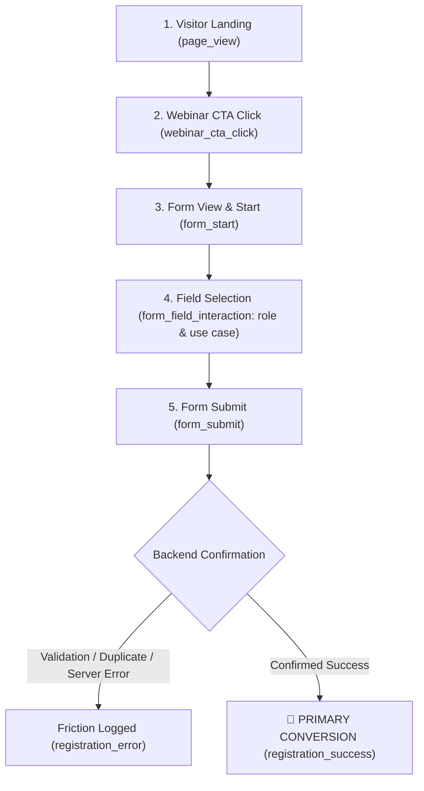

# 📊 AI PASSPORT™ — ANALYTICS & CONVERSION INFRASTRUCTURE

This document provides a comprehensive overview of the analytics, attribution, privacy, and conversion measurement infrastructure built for **AI Passport™ by Ekaakshar Education** ([https://aipassport.ekaakshareducation.com/](https://aipassport.ekaakshareducation.com/)).

---

## 🛠 1. ANALYTICS ARCHITECTURE

The site uses a **centralized, non-blocking Google Analytics 4 (GA4) architecture** built natively into the frontend module layer (`src/lib/analytics.js`).

### Architecture Principles:
1. **Single Central System**: All analytics logic is consolidated in `src/lib/analytics.js`. Micro-calls are not scattered across HTML templates.
2. **Zero Animation / Main-Thread Impact**: Asynchronous loading (`gtag.js`), debounced scroll observers, and IntersectionObserver-based section tracking ensure cinematic GSAP animations, Lenis smooth scrolling, and frame rates remain smooth (60 FPS).
3. **Environment-Driven Configuration**: Read from `import.meta.env.VITE_GA_MEASUREMENT_ID`. If unconfigured, analytics automatically falls back to safe local console debug mode without throwing runtime errors or network failures.
4. **Strict PII Protection**: Automatic sanitization strips names, emails, phone numbers, addresses, and form field content before data reaches GA4.
5. **Session-Persisted Campaign Attribution**: Captures URL campaign UTMs (`utm_source`, `utm_medium`, `utm_campaign`, etc.) and ad click IDs (`gclid`, `fbclid`), storing them in `sessionStorage` to maintain multi-page attribution.

---

## 📁 2. FILES & INTEGRATION

| File Path | Role | Description |
| :--- | :--- | :--- |
| [`src/lib/analytics.js`](file:///c:/Users/HP/Downloads/AIPASS/src/lib/analytics.js) | **Core Engine** | GA4 initialization, PII sanitization, attribution capture, event dispatcher, CTA auto-tracker, section observer, scroll depth tracker. |
| [`main.js`](file:///c:/Users/HP/Downloads/AIPASS/main.js) | **Main App Integration** | Initializes `analytics.js`, tracks registration form submissions, validation friction, duplicate user errors, backend confirmation, and AI Journey scroll stages. |
| [`login.html`](file:///c:/Users/HP/Downloads/AIPASS/login.html) | **Auth Page Integration** | Imports and initializes `analytics.js` for sign-in / demo login events. |
| [`src/app/app-entry.js`](file:///c:/Users/HP/Downloads/AIPASS/src/app/app-entry.js) | **Workspace Integration** | Initializes `analytics.js` in the authenticated learner workspace (`/app/`). |
| [`.env`](file:///c:/Users/HP/Downloads/AIPASS/.env) & [`.env.example`](file:///c:/Users/HP/Downloads/AIPASS/.env.example) | **Environment Config** | Stores `VITE_GA_MEASUREMENT_ID`. |

---

## 🔑 3. ENVIRONMENT VARIABLES & GA4 SETUP

To connect Google Analytics 4:

1. Open your `.env` file in the project root.
2. Add your GA4 Measurement ID:
   ```env
   VITE_GA_MEASUREMENT_ID=G-XXXXXXXXXX
   ```
3. Rebuild or restart the development server (`npm run dev` or `npm run build`).

> [!NOTE]
> When `VITE_GA_MEASUREMENT_ID` is empty or omitted, analytics will run in **Safe Local Debug Mode**, printing formatted event payloads to the browser console without sending network calls to GA4.

---

## 🏷 4. EVENT TAXONOMY & PARAMETERS

All events are formatted in `lowercase_snake_case`. Every event payload automatically includes page metadata (`page_path`, `page_title`), timestamp, and campaign attribution.

| Event Name | Type | Description | Key Parameters |
| :--- | :--- | :--- | :--- |
| `page_view` | System | Triggered on page load / view. | `page_path`, `page_title`, `page_location` |
| `section_view` | Engagement | Triggered when a major section enters the viewport (>25% visible for >500ms). | `section_id`, `section_name` |
| `scroll_depth` | Engagement | Triggered at 25%, 50%, 75%, 90% scroll marks. | `depth_percentage` |
| `cta_click` | Engagement | Triggered when a button, link, or card CTA is clicked. | `cta_name`, `cta_location`, `destination_url` |
| `webinar_cta_click` | Funnel | Triggered when a webinar registration CTA is clicked. | `cta_name`, `cta_location`, `destination_url` |
| `journey_stage_view` | Engagement | Triggered when user scrolls to an AI Journey stage (01-05). | `stage_name`, `stage_level` (1-5), `action` |
| `journey_stage_click` | Engagement | Triggered when user clicks/interacts with a stage. | `stage_name`, `stage_level` |
| `form_start` | Funnel | Triggered when user focuses the first field in a form. | `form_name`, `first_field` |
| `form_field_interaction` | Funnel | Triggered when user selects role or primary use case in dropdown. | `form_name`, `field_name`, `field_value_selected` |
| `form_submit` | Funnel | Triggered when user submits the registration form. | `form_name`, `role`, `use_case` |
| `registration_error` | Friction | Triggered on validation failure, duplicate user, or server error. | `form_name`, `error_type` (`validation_error`, `duplicate_user`, `server_error`), `field_name` |
| `registration_success` | **CONVERSION** | **Primary Business Outcome**. Fired ONLY when backend confirms registration success. | `form_name`, `passport_id_generated`, `currency` (`INR`), `value` (`1.0`) |
| `whatsapp_click` | Outbound | Triggered when user clicks WhatsApp link/button. | `destination_url`, `cta_location`, `link_type` (`whatsapp`) |
| `email_click` | Outbound | Triggered on `mailto:` link click. | `destination_url`, `cta_location`, `link_type` (`email`) |
| `phone_click` | Outbound | Triggered on `tel:` link click. | `destination_url`, `cta_location`, `link_type` (`phone`) |
| `outbound_click` | Outbound | Triggered on click to external third-party URL. | `destination_url`, `link_text`, `cta_location` |

---

## 🎯 5. WEBINAR CONVERSION FUNNEL & FRICTION MEASUREMENT

The primary conversion goal is **AI Passport Live Webinar Registration**. The funnel is structured as follows:



> [!IMPORTANT]
> A button click is **NEVER** counted as a successful conversion. `registration_success` fires **ONLY** after the Google Apps Script / database backend returns confirmation and `proceedToSuccess()` renders the ticket.

---

## 🔒 6. PRIVACY & SECURITY PROTECTIONS

- **Zero PII Leakage**: `sanitizeParams()` inspects all event parameters and strips matching email patterns (`user@domain.com`), phone numbers, full names, addresses, and passwords.
- **Metadata Only**: Only aggregated non-PII metadata (`role`, `use_case`, `error_type`, `cta_name`, `section_id`) is sent to GA4.
- **Non-Invasive**: Does not use fingerprinting, invasive cookies, or third-party cross-site trackers.
- **Fail-Safe**: If GA4 or network request is blocked by ad-blockers, the site code handles errors silently without interrupting user flow or form submission.

---

## 🗺 7. BUSINESS ANALYTICS MAP

This implementation answers key executive business questions:

| Business Dimension | Measured By | Business Insight Gained |
| :--- | :--- | :--- |
| **ACQUISITION** | `utm_source`, `utm_medium`, `traffic_source`, `referrer` | Identifies which channels (Google Ads, Meta, LinkedIn, WhatsApp, Organic) bring visitors to the site. |
| **ENGAGEMENT** | `section_view`, `scroll_depth`, `cta_click` | Shows which website sections (Mastery Levels, Proof & Projects, Ecosystem) users actually read. |
| **JOURNEY** | `journey_stage_view`, `journey_stage_click` | Tracks how far users progress through the 5 AI Journey levels (EXPLORE → CREATE → INNOVATE → BUILD → LEAD). |
| **CONVERSION** | `registration_success` | Measures exact count and conversion rate of confirmed webinar registrants. |
| **ATTRIBUTION** | `registration_success` + `utm_campaign` | Connects webinar registrations back to specific marketing campaigns & ads. |
| **FRICTION** | `registration_error` (`validation_error`, `duplicate_user`) | Highlights form drop-offs, validation mistakes, or duplicate registration attempts. |
| **CONTENT** | `cta_click` (destination: projects/passport) | Discovers which featured projects or curriculum topics generate the highest interest. |
| **DEVICE** | GA4 standard device dimension | Compares mobile vs desktop scroll completion, CTA interaction, and registration performance. |

---

## 🧪 8. TESTING & VERIFICATION

### Local Debugging
To inspect analytics events locally in your browser console:
1. Open [https://aipassport.ekaakshareducation.com/?debug_analytics=true](https://aipassport.ekaakshareducation.com/?debug_analytics=true) (or open DevTools console on `localhost`).
2. Open Browser DevTools Console (F12).
3. Look for logs prefixed with `%c[Analytics Event]` or `%c[AI Passport Analytics]`.

### GA4 Realtime / DebugView Verification
1. Install **Google Analytics Debugger** Chrome Extension (or use `?debug_analytics=true`).
2. Open GA4 Dashboard → **Admin** → **DebugView**.
3. Perform actions on the site (scroll, click CTAs, submit webinar form).
4. Verify events (`page_view`, `section_view`, `webinar_cta_click`, `registration_success`) appear in real-time.

---

## 📈 9. HOW TO USE GA4 AFTER DEPLOYMENT

Once your `VITE_GA_MEASUREMENT_ID` is set and traffic begins:

1. **Check Live Traffic**:
   - Go to **GA4 Home → Reports → Realtime**.
   - Watch live visitors, active pages, and event counts.

2. **Monitor Webinar Conversions**:
   - Go to **GA4 Admin → Conversions / Key Events**.
   - Ensure `registration_success` is marked as a **Key Event**.
   - View conversion rate under **Reports → Engagement → Conversions**.

3. **Analyze Marketing Campaign Attribution**:
   - Go to **Reports → Acquisition → Traffic acquisition**.
   - Change primary dimension to **Session primary channel group** or **Session Source / Medium**.
   - Compare which channel (e.g., `google / cpc` vs `instagram / cpc`) produced the highest `registration_success` conversions.

4. **Identify Form Friction**:
   - Go to **Reports → Engagement → Events**.
   - Click `registration_error`. Look at the `error_type` parameter breakdown to see if users are struggling with validation or duplicate registrations.
